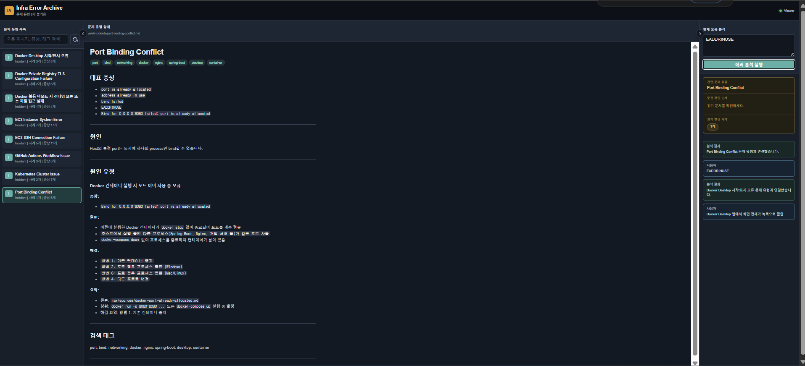

# Infra Error Archive

Infra Error Archive는 인프라 오류 기록을 `raw/sources/`에 넣으면 문제 유형별 Wiki로 정리하고, 웹 Viewer에서 검색과 해결 힌트를 확인할 수 있는 로컬 LLM Wiki 도구입니다.

## 사용법

### 1. 환경 준비

필수 환경:

- Python 3.10 이상
- 웹 브라우저

추가 Python 패키지는 필요하지 않습니다. MCP-style Tool과 Viewer는 Python 표준 라이브러리만 사용합니다.

```powershell
cd "Infra Error Archive"
python tools/wiki_mcp_server.py list-tools
```

Tool 목록이 출력되면 실행 환경이 준비된 상태입니다.

### 2. raw 자료 1건 작성

`raw/sources/` 아래에 Markdown 파일을 하나 만듭니다.

```text
raw/sources/my-error.md
```

권장 템플릿: `schema/raw-source-template.md`를 참고합니다.

현재 ingest는 `##` 제목을 기준으로 raw를 분류합니다. 원인과 해결이 Wiki에 잘 들어가게 하려면 `## 원인`, `## 해결 방법` 제목을 사용하는 것이 가장 안정적입니다.

### 3. Wiki로 통합

#### 방법 A: 직접 명령 실행

```powershell
python tools/wiki_mcp_server.py ingest-source raw/sources/my-error.md
```

결과:

- 새 문제 유형이면 `wiki/incidents/<slug>.md` 생성
- 기존 문제 유형이면 해당 Wiki Page에 발생 기록 추가
- `wiki/index.json` 갱신
- `logs/agent-actions.log`에 실행 기록 저장

#### 방법 B: Agent에게 통합 & 검증 요청

외부 Agent(Claude, Codex 등)에게는 이렇게 요청하면 됩니다.

```text
RULES.md를 읽고, skills/wiki-curator/SKILL.md 절차에 따라
raw/sources/my-error.md를 Wiki에 통합해줘.
raw 원본을 우선 근거로 보고, 통합 후 lint와 suggest-fix로 검증해줘.
```

Agent가 위 `ingest-source` 명령과 동일한 작업을 수행하고, `skills/wiki-curator/SKILL.md` 절차에 따라 검증 결과를 보고합니다.

### 4. 검증

```powershell
python tools/wiki_mcp_server.py lint
python tools/wiki_mcp_server.py search "port is already allocated"
python tools/wiki_mcp_server.py suggest-fix "listen tcp :3000: bind: address already in use"
```

확인 기준:

- `lint`가 통과해야 합니다.
- `search`에서 방금 만든 문제 유형이 검색되어야 합니다.
- `suggest-fix`가 관련 Wiki를 찾아 확인 순서와 해결 요약을 반환해야 합니다.

### 5. Viewer 실행

```powershell
python tools/viewer_server.py
```

브라우저에서 엽니다.

```text
http://127.0.0.1:8000/
```

다른 포트를 쓰려면:

```powershell
python tools/viewer_server.py --port 8080
```

## Package 구성

```text
Infra Error Archive/
├─ README.md
├─ RULES.md
├─ docs/
├─ schema/
│  ├─ raw-source-template.md
│  └─ wiki-page-template.md
├─ skills/wiki-curator/SKILL.md
├─ tools/
│  ├─ wiki_mcp_server.py
│  └─ viewer_server.py
├─ server/
├─ raw/sources/
├─ wiki/
│  ├─ index.json
│  └─ incidents/
├─ web/
└─ demo/
```

## 구성 요소

| 경로 | 역할 | 대응 항목 |
| --- | --- | --- |
| `RULES.md` | Agent 운영지침. raw 우선 원칙, 허용/금지 작업, 통합 절차, 검증 기준 정의 | 하네스 |
| `skills/wiki-curator/SKILL.md` | Wiki Curator Skill. 외부 Agent가 raw를 Wiki로 통합할 때 따르는 실행 절차 (`list-tools` → `ingest-source` → `lint` → `suggest-fix`) | 하네스 |
| `docs/` | 도메인 정의, 의사결정 기록, PRD 보조 컨텍스트 | 하네스 |
| `raw/sources/`, `wiki/incidents/`, `wiki/index.json`, `schema/` | 원본 오류 기록, 문제 유형별 Wiki Page, Wiki metadata, 작성 템플릿. raw가 가장 높은 우선순위 근거이며 raw-Wiki 충돌 시 raw 기준 | LLM Wiki |
| `tools/wiki_mcp_server.py` | Agent가 접근하는 MCP-style CLI Tool 진입점 | 시각화 도구 |
| `tools/viewer_server.py`, `web/` | Viewer 서버와 브라우저 UI (왼쪽: 문제 유형 목록/검색, 가운데: Wiki Page, 오른쪽: 오류 분석) | 시각화 도구 |

## MCP Tool 목록

```powershell
python tools/wiki_mcp_server.py list-tools
```

| Tool | CLI | 동작 |
| --- | --- | --- |
| `ingest_source` | `ingest-source` | raw 자료를 Wiki Page로 생성하거나 기존 Page에 병합 |
| `search_wiki` | `search` | Wiki Page 검색 |
| `get_wiki_page` | `get-page` | slug로 Wiki Page 조회 |
| `suggest_fix` | `suggest-fix` | 오류 메시지와 가까운 Wiki를 찾아 확인 순서와 해결 요약 반환 |
| `create_wiki_page` | `create-page` | 새 Wiki Page 생성 |
| `update_wiki_page` | `update-page` | 기존 Wiki Page 수정 |
| `lint_wiki` | `lint` | `wiki/index.json`과 Wiki 파일 정합성 검사 |
| `list_categories` | `list-categories` | Wiki category 목록 조회 |

## Demo

`demo/demo.png`는 실제 지식베이스가 Viewer에 렌더링된 화면입니다. 왼쪽 문제 유형 목록, 가운데 Wiki Page, 오른쪽 오류 분석 패널이 함께 동작하는 모습을 확인할 수 있습니다.


